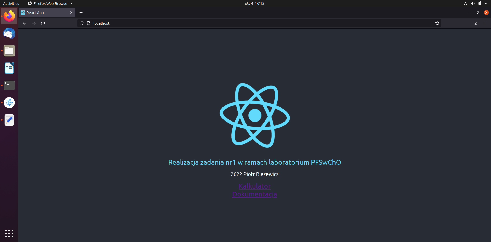
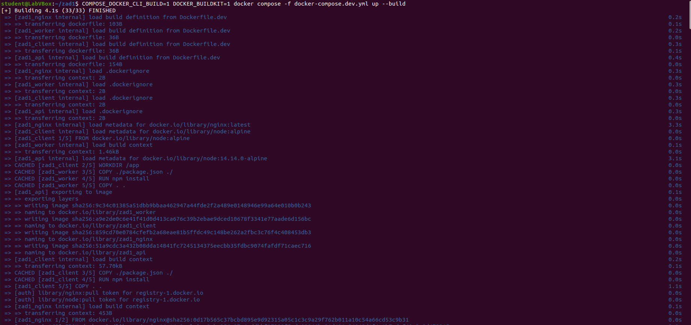
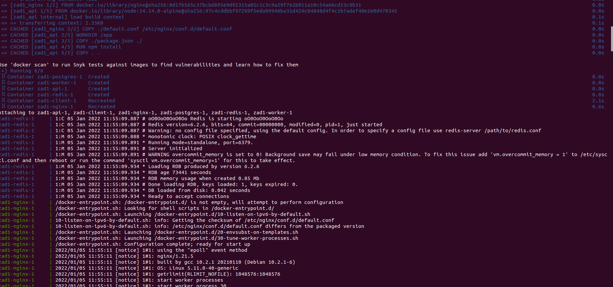
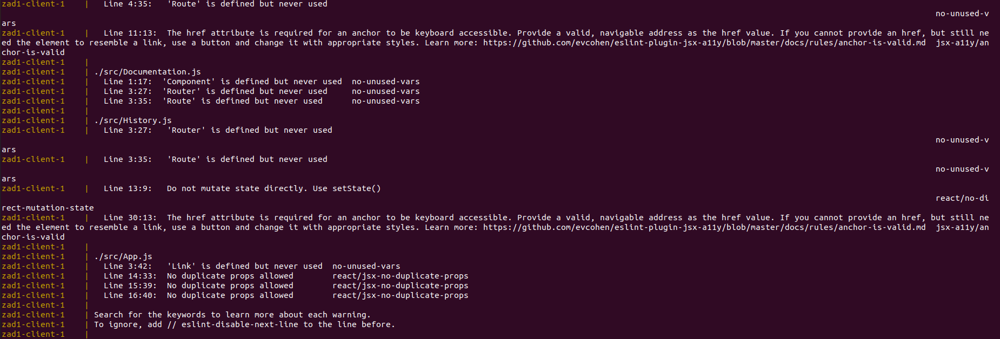

# Fibonacci-project

## Aplikacja została zaprojektowana na bazie zadania 9.

## Zmodyfikowano elementy:
### client:
- **Fib.js** - dodano metody umożliwiające interakcję z modułem historii, dodano "required" do pola input aby uniemożliwić podanie pustej wartości
- **App.js** - zrealizowano w formie routera React

### server:
- **index.js** - zmieniono limit dla indeksu k do 20

### worker:
- **index.js** - zmieniono funkcję obliczającą k-ty wyraz ciągu

## Dodano elementy:
- **Main.js** - komponent strony głównej
- **Documentation.js** - komponent dokumentacji
- **History.js** - komponent wyświetlający historię ostatnich wpisanych indeksów

## Uruchomienie usługi
W celu uruchomienia usługi należy w katalogu głównym repozytorium użyć polecenia:

`COMPOSE_DOCKER_CLI_BUILD=1 DOCKER_BUILDKIT=1 docker compose -f docker-compose.dev.yml up --build`

Aplikacja jest dostępna na porcie 80.

## Zrzuty ekranu potwierdzajace uruchomienie usługi

